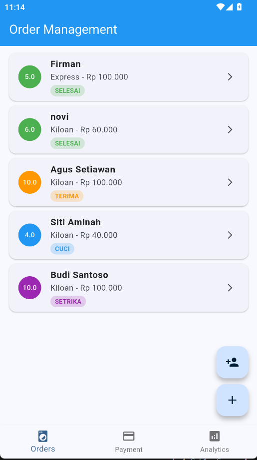
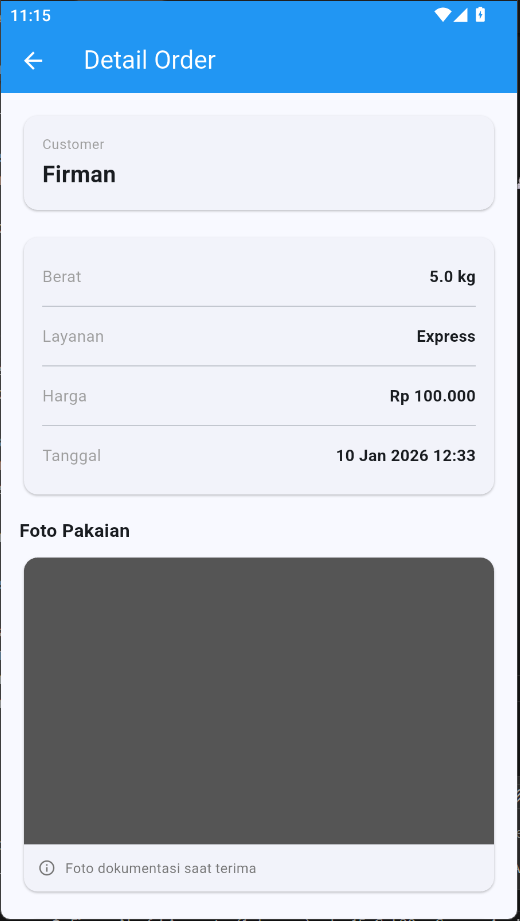
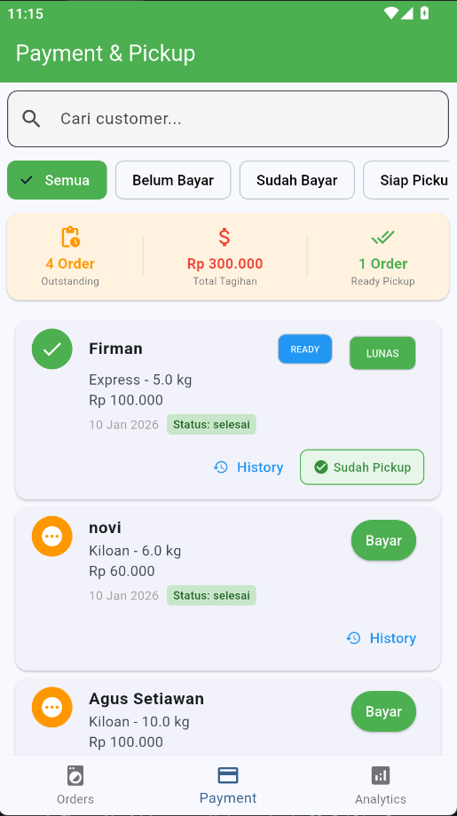
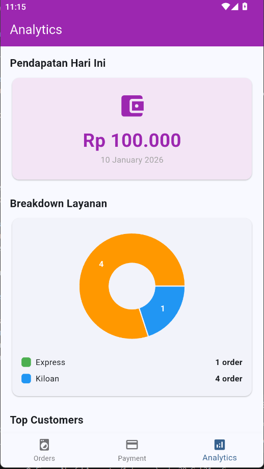

# LaundryKu - Aplikasi Manajemen Laundry


## 📱 Deskripsi Aplikasi

**LaundryKu** adalah aplikasi mobile berbasis Flutter untuk manajemen bisnis laundry yang memudahkan pemilik laundry dalam mengelola pesanan, pembayaran, dan analitik bisnis. Aplikasi ini menggunakan Supabase sebagai backend untuk penyimpanan data real-time.

### ✨ Fitur Utama

#### � **Manajemen Pesanan & Pelanggan**
- **Customer Registration** - Registrasi customer dengan data lengkap (nama, phone, alamat)
- **Order Entry** - Pencatatan order dengan berbagai jenis layanan (Kiloan, Satuan, Express)
- **Status Tracking** - Real-time tracking status order (Terima → Cuci → Setrika → Selesai)
- **Photo Documentation** - Upload foto pakaian saat terima order ke Supabase Storage
- **Customer Search** - Dropdown autocomplete untuk cari customer by name
- **Order History** - List semua order dengan filter dan search

#### 💰 **Pembayaran & Pengambilan**
- **Payment Recording** - Recording pembayaran dengan 4 metode:
  - Tunai
  - Transfer Bank
  - E-Wallet (GoPay, OVO, Dana)
  - Debit/Kredit Card
- **Pickup Notification** - Notifikasi untuk customer saat order siap diambil
  - Badge "READY" untuk order yang selesai & lunas
  - Button "Notify Pickup" yang bisa diklik
  - Status "Sudah Pickup" setelah notifikasi terkirim
  - Tracking pickup_date di database
- **Transaction History** - Riwayat transaksi lengkap per customer dengan summary:
  - Total orders
  - Total amount spent
  - Unpaid orders count
- **Outstanding Payment Tracking** - Dashboard summary dengan 3 metrics:
  - Total outstanding orders
  - Total tagihan belum bayar
  - Ready for pickup count
- **Filter & Search** - Smart filter (Semua, Belum Bayar, Sudah Bayar, Siap Pickup) + customer search

#### 📊 **Analitik & Laporan**
- **Daily Revenue** - Dashboard pendapatan hari ini (real-time)
- **Service Breakdown** - Pie chart breakdown per jenis layanan
- **Customer Analysis** - Analisis customer frequency dengan ranking
- **Top Customers** - Top 5 customers by order count
- **Monthly Summary** - Total pendapatan, transaksi, dan rata-rata per bulan

### 🛠️ Teknologi yang Digunakan

- **Framework:** Flutter dengan Dart SDK 3.9.2
- **Backend:** Supabase (PostgreSQL) + SQLite (Local DB)
- **State Management:** Provider Pattern
- **Chart Library:** FL Chart
- **Image Handling:** Image Picker + Camera Integration
- **Local Database:** SQLite (sqflite) untuk offline support
- **Cloud Database:** PostgreSQL via Supabase REST API
- **Security:** Environment Variables (flutter_dotenv)
- **Notifications:** Simple In-App Notifications (SnackBar & Dialog)
- **Architecture:** Offline-First dengan Cloud Sync

### 🎯 Pre-Submission Checklist Compliance

#### ✅ Code Quality (40%)
- ✅ Code clean, readable, proper indentation
- ✅ Variable & function names jelas (camelCase)
- ✅ Comments untuk complex logic & business rules
- ✅ Error handling implemented dengan try-catch di semua operations
- ✅ Proper state management dengan Provider pattern

#### ✅ Functionality (30%)
- ✅ Semua modul requirements terimplementasi lengkap
- ✅ CRUD operations berfungsi (Create, Read, Update)
- ✅ Camera integration working (ImagePicker)
- ✅ Charts & visualizations tampil (FL Chart - Pie Chart, Bar Chart)
- ✅ In-app notifications implemented (SnackBar untuk pickup ready)
- ✅ Data persistence (SQLite local + Supabase cloud sync)

#### ✅ Technical Implementation (30%)
- ✅ Local database (SQLite) proper setup dengan offline-first architecture
- ✅ REST API integration via Supabase Client SDK
- ✅ Responsive design dengan MediaQuery untuk tablet/phone
- ✅ Performance optimization (Indexes, async/await, lazy loading)
- ✅ Security best practices (Environment variables, no hardcoded credentials)

---

## 📸 Screenshot Demo

### 1. Order Management Screen

*Halaman utama untuk melihat dan mengelola semua pesanan laundry*

### 2. Add Order Screen

*Form untuk menambahkan pesanan baru dengan pilih pelanggan dan detail layanan*

### 3. Order Detail Screen

*Detail pesanan dengan opsi update status, upload foto, dan notifikasi pickup*

### 4. Payment Screen

*Manajemen pembayaran dengan form input dan riwayat transaksi*

### 5. Analytics Screen

*Dashboard analitik dengan grafik pendapatan dan statistik bisnis*

---

## 📥 Download APK/AAB untuk Testing

### 🔗 Link Download
Download file APK/AAB untuk testing aplikasi:

- **📦 APK (Android Package)**: [Download APK dari Google Drive](https://drive.google.com/file/d/1iyEeVedu2OjKJNzOhvDIYMd9lK37XJRJ/view?usp=sharing)
- **📦 AAB (Android App Bundle)**: [Download AAB dari Google Drive](https://drive.google.com/file/d/1jhoDYMnS4cgb271q1auYwCRF2uAe5rcD/view?usp=sharing)

> **Catatan:** 
> - APK dapat langsung diinstall di perangkat Android
> - AAB digunakan untuk upload ke Google Play Store
> - Ukuran file APK: ~50-60 MB (tergantung build type)

### 📱 Cara Install APK
1. Download file APK dari link di atas
2. Buka **Settings** → **Security** → Aktifkan **"Install from Unknown Sources"**
3. Buka file APK yang sudah didownload
4. Tap **Install** dan tunggu proses instalasi selesai
5. Aplikasi **LaundryKu** siap digunakan! 🎉

### 🛠️ Build APK/AAB Sendiri (Opsional)

Jika ingin build sendiri dari source code:

**Build Debug APK:**
```bash
flutter build apk --debug
```

**Build Release APK:**
```bash
flutter build apk --release
```

**Build Release AAB:**
```bash
flutter build appbundle --release
```

**Build Split APK (ukuran lebih kecil):**
```bash
flutter build apk --split-per-abi
```

Hasil build ada di: `build/app/outputs/`

---

## 🚀 Cara Menjalankan Aplikasi

### Prerequisites
Pastikan Anda sudah menginstall:
- Flutter SDK (latest stable version)
- Dart SDK 3.9.2 atau lebih baru (included dengan Flutter)
- Android Studio / VS Code dengan Flutter extension
- Git
- Emulator Android atau perangkat fisik

### Langkah Instalasi

1. **Clone Repository**
   ```bash
   git clone <repository-url>
   cd laundrykuu
   ```

2. **Install Dependencies**
   ```bash
   flutter pub get
   ```

3. **Setup Environment Variables (Security)**
   - Copy file `.env.example` ke `.env`:
     ```bash
     copy .env.example .env   # Windows
     cp .env.example .env     # Linux/Mac
     ```
   - Edit file `.env` dan isi dengan credentials Supabase Anda:
     ```env
     SUPABASE_URL=https://your-project.supabase.co
     SUPABASE_ANON_KEY=your-anon-key-here
     ```
   - **PENTING:** Jangan commit file `.env` ke Git!

4. **Setup Supabase Database**
   - Buat project baru di [Supabase](https://supabase.com)
   - Copy URL dan Anon Key dari project settings
   - Setup database schema (lihat section Database Schema di bawah)
   - Buat Storage bucket untuk foto (nama: `order-photos`)

5. **Jalankan Aplikasi**
   
   **Mode Debug:**
   ```bash
   flutter run
   ```
   
   **Build APK Release:**
   ```bash
   flutter build apk --release
   ```
   
   **Build APK Split per ABI (ukuran lebih kecil):**
   ```bash
   flutter build apk --split-per-abi
   ```

6. **Running on Specific Device**
   ```bash
   # Lihat daftar device
   flutter devices
   
   # Run di device tertentu
   flutter run -d <device-id>
   ```

---

## 🗄️ Database Schema

Aplikasi ini menggunakan **Hybrid Database Architecture**:
- **SQLite (Local)**: Untuk offline support dan performance
- **Supabase PostgreSQL (Cloud)**: Untuk cloud backup dan sync

### 🏗️ Architecture: Offline-First dengan Cloud Sync

```
┌─────────────────┐
│   Flutter App   │
└────────┬────────┘
         │
    ┌────┴────┐
    │         │
┌───▼───┐ ┌──▼────┐
│SQLite │ │Supa   │
│Local  │ │base   │
│  DB   │ │Cloud  │
└───────┘ └───────┘
  Fast      Sync
```

**Flow:**
1. Semua operasi CRUD → SQLite local dulu (fast & offline capable)
2. Background sync → Supabase untuk cloud backup
3. Read: Try Supabase first, fallback ke SQLite jika offline

---

### Tabel: `customers`
Menyimpan data pelanggan laundry.

#### Supabase (Cloud)

```sql
CREATE TABLE customers (
  id BIGSERIAL PRIMARY KEY,
  name VARCHAR(255) NOT NULL,
  phone VARCHAR(20) NOT NULL UNIQUE,
  address TEXT NOT NULL,
  created_at TIMESTAMP WITH TIME ZONE DEFAULT NOW()
);

-- Index untuk pencarian cepat berdasarkan nomor telepon
CREATE INDEX idx_customers_phone ON customers(phone);
```

**Kolom:**
- `id`: Primary key, auto-increment
- `name`: Nama pelanggan
- `phone`: Nomor telepon (unique)
- `address`: Alamat pelanggan
- `created_at`: Timestamp pembuatan data

---

### Tabel: `orders`
Menyimpan data pesanan laundry.

```sql
CREATE TABLE orders (
  id BIGSERIAL PRIMARY KEY,
  customer_id BIGINT NOT NULL REFERENCES customers(id) ON DELETE CASCADE,
  weight DECIMAL(10,2) NOT NULL,
  service_type VARCHAR(50) NOT NULL,
  price DECIMAL(10,2) NOT NULL,
  status VARCHAR(20) NOT NULL DEFAULT 'terima',
  photo_url TEXT,
  pickup_notified BOOLEAN DEFAULT FALSE,
  pickup_date TIMESTAMP WITH TIME ZONE,
  date TIMESTAMP WITH TIME ZONE DEFAULT NOW()
);

-- Index untuk query yang sering digunakan
CREATE INDEX idx_orders_customer_id ON orders(customer_id);
CREATE INDEX idx_orders_status ON orders(status);
CREATE INDEX idx_orders_date ON orders(date DESC);
```

**Kolom:**
- `id`: Primary key, auto-increment
- `customer_id`: Foreign key ke tabel customers
- `weight`: Berat laundry (kg)
- `service_type`: Jenis layanan (Cuci Kering, Cuci Setrika, Setrika Saja)
- `price`: Harga total
- `status`: Status pesanan (terima, proses, selesai, diambil)
- `photo_url`: URL foto pesanan (dari Supabase Storage)
- `pickup_notified`: Flag apakah pelanggan sudah dinotifikasi
- `pickup_date`: Tanggal notifikasi pickup
- `date`: Tanggal pesanan dibuat

**Status Values:**
- `terima`: Pesanan baru diterima
- `proses`: Sedang dikerjakan
- `selesai`: Selesai dikerjakan, siap diambil
- `diambil`: Sudah diambil pelanggan

---

### Tabel: `payments`
Menyimpan data pembayaran pesanan.

```sql
CREATE TABLE payments (
  id BIGSERIAL PRIMARY KEY,
  order_id BIGINT NOT NULL REFERENCES orders(id) ON DELETE CASCADE,
  amount DECIMAL(10,2) NOT NULL,
  payment_method VARCHAR(50) NOT NULL,
  paid_date TIMESTAMP WITH TIME ZONE DEFAULT NOW()
);

-- Index untuk query pembayaran
CREATE INDEX idx_payments_order_id ON payments(order_id);
CREATE INDEX idx_payments_paid_date ON payments(paid_date DESC);
```

**Kolom:**
- `id`: Primary key, auto-increment
- `order_id`: Foreign key ke tabel orders
- `amount`: Jumlah pembayaran
- `payment_method`: Metode pembayaran (Tunai, Transfer, E-Wallet)
- `paid_date`: Tanggal pembayaran

---

### Relasi Antar Tabel

```
customers (1) ─────< (N) orders
                           │
                           │
                           └─────< (N) payments
```

- Satu customer bisa memiliki banyak orders (One-to-Many)
- Satu order bisa memiliki banyak payments (One-to-Many)

---

### Supabase Storage Bucket

Untuk menyimpan foto pesanan:

```sql
-- Buat storage bucket
INSERT INTO storage.buckets (id, name, public)
VALUES ('order-photos', 'order-photos', true);

-- Policy untuk upload (authenticated users)
CREATE POLICY "Allow authenticated uploads"
ON storage.objects FOR INSERT
TO authenticated
WITH CHECK (bucket_id = 'order-photos');

-- Policy untuk public access (read)
CREATE POLICY "Public read access"
ON storage.objects FOR SELECT
TO public
USING (bucket_id = 'order-photos');
```

---

### Setup Database di Supabase

1. Login ke [Supabase Dashboard](https://supabase.com/dashboard)
2. Buka SQL Editor
3. Jalankan script SQL di atas secara berurutan
4. Verifikasi tabel sudah terbuat di Table Editor
5. Setup Storage bucket untuk foto

---

## 📡 API Documentation

Aplikasi ini menggunakan **Supabase REST API** dan **Supabase Realtime** untuk komunikasi dengan database.

### Base Configuration

```dart
// lib/config/supabase_config.dart
Supabase URL: https://[your-project].supabase.co
Anon Key: [your-anon-key]
```

### Service Layer

Semua operasi database di-handle melalui `SupabaseService` class di `lib/services/supabase_service.dart`.

---

### 👥 Customer Endpoints

#### 1. Get All Customers
```dart
Future<List<Customer>> getCustomers()
```
**Query:**
```sql
SELECT * FROM customers ORDER BY created_at DESC
```
**Response:** List of Customer objects

---

#### 2. Create Customer
```dart
Future<Customer> createCustomer(Customer customer)
```
**Payload:**
```json
{
  "name": "John Doe",
  "phone": "081234567890",
  "address": "Jl. Example No. 123"
}
```
**Response:** Created Customer object

---

#### 3. Search Customer by Phone
```dart
Future<Customer?> searchCustomerByPhone(String phone)
```
**Query:**
```sql
SELECT * FROM customers WHERE phone = ?
```
**Response:** Customer object or null

---

### 📦 Order Endpoints

#### 4. Get All Orders (with Customer Join)
```dart
Future<List<Order>> getOrders()
```
**Query:**
```sql
SELECT orders.*, customers.name 
FROM orders 
LEFT JOIN customers ON orders.customer_id = customers.id 
ORDER BY date DESC
```
**Response:** List of Order objects with customer name

---

#### 5. Get Orders by Customer
```dart
Future<List<Order>> getOrdersByCustomer(String customerId)
```
**Query:**
```sql
SELECT orders.*, customers.name 
FROM orders 
WHERE customer_id = ?
ORDER BY date DESC
```
**Response:** List of Order objects

---

#### 6. Create Order
```dart
Future<Order> createOrder(Order order)
```
**Payload:**
```json
{
  "customer_id": "1",
  "weight": 5.5,
  "service_type": "Cuci Setrika",
  "price": 27500,
  "status": "terima",
  "date": "2026-01-10T10:00:00Z"
}
```
**Response:** Created Order object

---

#### 7. Update Order Status
```dart
Future<void> updateOrderStatus(String orderId, String status)
```
**Payload:**
```json
{
  "status": "proses" // atau "selesai", "diambil"
}
```

---

#### 8. Update Order Photo
```dart
Future<void> updateOrderPhoto(String orderId, String photoUrl)
```
**Payload:**
```json
{
  "photo_url": "https://supabase-storage-url/order-photos/image.jpg"
}
```

---

#### 9. Mark Pickup Notified
```dart
Future<void> markPickupNotified(String orderId)
```
**Payload:**
```json
{
  "pickup_notified": true,
  "pickup_date": "2026-01-10T15:30:00Z"
}
```

---

### 💰 Payment Endpoints

#### 10. Get All Payments
```dart
Future<List<Payment>> getPayments()
```
**Query:**
```sql
SELECT * FROM payments ORDER BY paid_date DESC
```
**Response:** List of Payment objects

---

#### 11. Get Payment by Order
```dart
Future<Payment?> getPaymentByOrder(String orderId)
```
**Query:**
```sql
SELECT * FROM payments WHERE order_id = ?
```
**Response:** Payment object or null

---

#### 12. Create Payment
```dart
Future<Payment> createPayment(Payment payment)
```
**Payload:**
```json
{
  "order_id": "1",
  "amount": 27500,
  "payment_method": "Tunai",
  "paid_date": "2026-01-10T16:00:00Z"
}
```
**Response:** Created Payment object

---

### 📊 Analytics Endpoints

#### 13. Get Daily Revenue
```dart
Future<double> getDailyRevenue(DateTime date)
```
**Query:** Aggregate SUM of payments for specific date

---

#### 14. Get Monthly Revenue
```dart
Future<Map<String, dynamic>> getMonthlyRevenue(int year, int month)
```
**Query:** Aggregate SUM of payments for specific month
**Returns:** Map dengan total revenue dan detail per bulan

---

#### 15. Get Order Count by Status
```dart
Future<Map<String, int>> getOrderCountByStatus()
```
**Returns:**
```json
{
  "terima": 5,
  "proses": 3,
  "selesai": 10,
  "diambil": 25
}
```

---

#### 16. Get Service Type Breakdown
```dart
Future<Map<String, int>> getServiceTypeBreakdown()
```
**Returns:**
```json
{
  "Cuci Kering": 15,
  "Cuci Setrika": 30,
  "Setrika Saja": 10
}
```

---

### 📷 Storage API (Photo Upload)

#### Upload Order Photo
```dart
Future<String> uploadOrderPhoto(String orderId, File imageFile)
```
**Process:**
1. Upload file ke Supabase Storage bucket `order-photos`
2. Generate filename: `order_${orderId}_${timestamp}.jpg`
3. Return public URL

**Response:**
```
https://[project].supabase.co/storage/v1/object/public/order-photos/order_123_1736505600.jpg
```

---

### 🔔 WhatsApp Integration

#### Send Pickup Notification
```dart
Future<void> sendWhatsAppNotification(String phone, String customerName, String orderId)
```
**Implementation:**
```dart
final url = 'https://wa.me/$phone?text=${Uri.encodeComponent(message)}';
await launchUrl(Uri.parse(url));
```

**Message Template:**
```
Halo [Customer Name]!
Pesanan laundry Anda (Order #[Order ID]) sudah selesai dan siap untuk diambil.
Terima kasih telah menggunakan layanan LaundryKu! 🧺
```

---

### Error Handling

Semua API calls wrapped dengan try-catch dan throw Exception dengan pesan error yang jelas:

```dart
try {
  // API call
} catch (e) {
  throw Exception('Failed to [operation]: $e');
}
```

**Common Error Responses:**
- `Failed to fetch customers`: Gagal mengambil data pelanggan
- `Failed to create order`: Gagal membuat pesanan
- `Failed to update order status`: Gagal update status
- `Failed to upload photo`: Gagal upload foto

---

## 📝 Catatan Pengembangan

### State Management Pattern
Aplikasi menggunakan **Provider** pattern dengan 3 provider utama:
- `OrderProvider`: Manage state orders
- `PaymentProvider`: Manage state payments
- `AnalyticsProvider`: Manage state analytics data

### Code Structure
```
lib/
├── config/           # Konfigurasi (Supabase)
├── models/           # Data models
├── providers/        # State management
├── screens/          # UI screens
├── services/         # API services
└── main.dart         # Entry point
```

### Best Practices
- Repository pattern untuk data access
- Separation of concerns (UI, Logic, Data)
- Async/await untuk semua database operations
- Error handling di setiap API call
- Loading states untuk UX yang baik

---

## 👨‍💻 Developer

Developed by: [Your Name]  
University: [Your University]  
Semester: 7  
Course: Mobile Development

---

## 📄 License

This project is private and intended for educational purposes.

---

## 🤝 Kontribusi

Jika Anda menemukan bug atau ingin menambahkan fitur:
1. Fork repository ini
2. Buat branch baru (`git checkout -b feature/AmazingFeature`)
3. Commit perubahan (`git commit -m 'Add some AmazingFeature'`)
4. Push ke branch (`git push origin feature/AmazingFeature`)
5. Buat Pull Request

---

## 📞 Kontak & Support

Jika ada pertanyaan atau butuh bantuan:
- Email: [firmannaufal2111@gmail.com]
- GitHub: [[Firmanarpp](http://github.com/Firmanarpp)]
- WhatsApp: [081717444053]

---

**Made with ❤️ using Flutter & Supabase**
